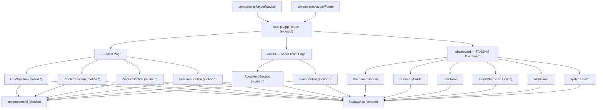

# Product Portfolio Website — Implementation Plan

## Goal Description

Build a polished, responsive **product portfolio website** for a service/agency, featuring:

- **Main Page** — Hero Section · Problem to Solve · Product · Product Features
- **About Team Page** — team intro and member cards

**Stack**: Next.js 14 (App Router) · TypeScript · Tailwind CSS · shadcn/ui · Framer Motion
**Deployment target**: Static export or Vercel (zero config)

---

## User Review Required

> [!IMPORTANT]
> The content (copy, images, team member names, product names) will be stored in plain TypeScript data files (`lib/data/*.ts`). You can edit these files after scaffolding without touching any component code.

> [!NOTE]
> Framer Motion's `motion.*` components and `useInView` / `useAnimation` hooks are client-side. Section components that use them must be marked `"use client"`. Server components (page files) stay server-only and just import the client section components.

---

## Open Questions

> [!IMPORTANT]
> **Brand colors & fonts** — The plan defaults to a neutral slate/blue palette and Inter font. If you have specific brand colors (hex codes) or a preferred Google Font, let me know before execution so we can bake them in from the start.

> [!NOTE]
> **Number of product features** — The plan scaffolds 4 feature cards. We can add/remove them by editing the data file only.

> [!NOTE]
> **Number of team members** — The plan scaffolds 4 team member cards. Same pattern — data-driven, easy to change.

---

## Architecture Overview



---

## Proposed Changes

### 1. Project Bootstrap

#### [NEW] `package.json` (auto-generated by Next.js CLI)

Run:
```bash
npx create-next-app@latest . \
  --typescript \
  --tailwind \
  --app \
  --src-dir \
  --import-alias "@/*" \
  --eslint
```

Then add dependencies:
```bash
npm install framer-motion
npx shadcn@latest init
```

shadcn/ui init answers:
- Style: **Default**
- Base color: **Slate**
- CSS variables: **Yes**

---

### 2. Project Structure

```
tangkis/
├── src/
│   ├── app/
│   │   ├── layout.tsx          # Root layout (Navbar + Footer)
│   │   ├── page.tsx            # Main Page
│   │   ├── about/
│   │   │   └── page.tsx        # About Team Page
│   │   ├── dashboard/
│   │   │   └── page.tsx        # TANGKIS Monitoring Dashboard Page
│   │   └── globals.css         # Tailwind directives + CSS vars
│   ├── components/
│   │   ├── layout/
│   │   │   ├── Navbar.tsx
│   │   │   └── Footer.tsx
│   │   ├── sections/           # All "use client" — use motion.*
│   │   │   ├── HeroSection.tsx
│   │   │   ├── ProblemSection.tsx
│   │   │   ├── ProductSection.tsx
│   │   │   ├── FeaturesSection.tsx
│   │   │   ├── AboutHeroSection.tsx
│   │   │   ├── TeamSection.tsx
│   │   │   └── dashboard/      # Dashboard components (matching demodashboard.html)
│   │   │       ├── DashboardTopbar.tsx
│   │   │       ├── SummaryCards.tsx
│   │   │       ├── TankTable.tsx
│   │   │       ├── TrendChart.tsx
│   │   │       ├── AlertPanel.tsx
│   │   │       └── SystemHealth.tsx
│   │   ├── ui/                 # shadcn components (auto-generated)
│   │   └── motion/
│   │       └── FadeUp.tsx      # Reusable scroll-triggered fade-up wrapper
│   └── lib/
│       ├── data/
│       │   ├── product.ts      # Product name, tagline, description
│       │   ├── features.ts     # Feature cards array
│       │   ├── problems.ts     # Problem cards array
│       │   ├── team.ts         # Team member array
│       │   └── dashboard.ts    # Tank monitoring data, thresholds, trend points & health status
│       └── utils.ts            # cn() helper (shadcn default)
├── public/
│   └── images/                 # Static images (team photos, product screenshots)
├── tailwind.config.ts
├── next.config.ts
└── tsconfig.json
```

---

### 3. Content Data Layer

#### [NEW] `src/lib/data/product.ts`
```ts
export const product = {
  name: "Your Product Name",
  tagline: "A short, punchy tagline goes here.",
  description:
    "A concise paragraph describing your product or service and the value it delivers.",
  heroImage: "/images/hero.png",
  productImage: "/images/product.png",
};
```

#### [NEW] `src/lib/data/problems.ts`
```ts
export const problems = [
  {
    id: 1,
    icon: "⚡",
    title: "Problem One",
    description: "Describe the pain point your customers face.",
  },
  {
    id: 2,
    icon: "🔒",
    title: "Problem Two",
    description: "Another pain point you solve.",
  },
  {
    id: 3,
    icon: "📉",
    title: "Problem Three",
    description: "Yet another friction your product eliminates.",
  },
];
```

#### [NEW] `src/lib/data/features.ts`
```ts
export const features = [
  {
    id: 1,
    icon: "🚀",
    title: "Feature One",
    description: "What this feature does and why it matters.",
  },
  // … 3 more
];
```

#### [NEW] `src/lib/data/team.ts`
```ts
export const team = [
  {
    id: 1,
    name: "Jane Doe",
    role: "Co-Founder & CEO",
    photo: "/images/team/jane.jpg",
    bio: "Short bio sentence.",
    linkedin: "https://linkedin.com/in/janedoe",
  },
  // … 3 more
];
```

#### [NEW] `src/lib/data/dashboard.ts`
```ts
export const AMBANG = { kuningMulai: 220, batas: 300 };

export const TANGKI = [
  { kode: "TK-01", lokasi: "Rumah Sakit A — Tangki Utama", airPpm: 412, suhuC: 36, hari: 187, status: "MERAH" },
  { kode: "TK-02", lokasi: "Rumah Sakit A — Day Tank", airPpm: 268, suhuC: 34, hari: 42, status: "KUNING" },
  { kode: "TK-03", lokasi: "Menara Perkantoran B — Basement", airPpm: 195, suhuC: 31, hari: 63, status: "HIJAU" },
  { kode: "TK-04", lokasi: "Menara Perkantoran B — Cadangan", airPpm: 241, suhuC: 33, hari: 96, status: "KUNING" },
  { kode: "TK-05", lokasi: "Pusat Data C — Ruang Genset 1", airPpm: 158, suhuC: 29, hari: 21, status: "HIJAU" },
];

export const TREN = {
  kode: "TK-01",
  judul: "Tren Kadar Air — TK-01 (Rumah Sakit A, Tangki Utama)",
  bulan: ["Apr 2026", "Mei 2026", "Jun 2026", "Jul 2026", "Agu 2026", "Sep 2026"],
  ppm: [232, 261, 294, 331, 376, 412],
  sumbuY: { min: 200, max: 450, langkah: 50 },
};

export const PERINGATAN = {
  kode: "TK-01",
  tenggatPembersihanHari: 14,
  rekomendasiTindakan: "Inspeksi dan pembersihan tangki",
};

export const STATUS_SISTEM = [
  { ikon: "sensor", nama: "Jaringan sensor", nilai: "ONLINE", kondisi: "ok" },
  { ikon: "gateway", nama: "Gateway ESP32", nilai: "ONLINE", kondisi: "ok" },
  { ikon: "aliran", nama: "Aliran data", nilai: "LIVE", kondisi: "info" },
  { ikon: "pantau", nama: "Status pemantauan", nilai: "AKTIF", kondisi: "ok" },
];
```

---

### 4. Layout

#### [NEW] `src/app/layout.tsx`
- Imports `Inter` from `next/font/google`
- Renders `<Navbar />`, `{children}`, `<Footer />`
- Sets `<html lang="en">` and metadata defaults
- **No global init needed** — Framer Motion is tree-shaken per-component

#### [NEW] `src/components/motion/FadeUp.tsx`

A reusable scroll-triggered animation wrapper used by every section. Eliminates repeating `motion.div` + `useInView` boilerplate in each section component.

```tsx
"use client";
import { useRef } from "react";
import { motion, useInView } from "framer-motion";

interface FadeUpProps {
  children: React.ReactNode;
  delay?: number;
  className?: string;
}

export default function FadeUp({ children, delay = 0, className }: FadeUpProps) {
  const ref = useRef(null);
  const isInView = useInView(ref, { once: true, margin: "-80px" });

  return (
    <motion.div
      ref={ref}
      initial={{ opacity: 0, y: 40 }}
      animate={isInView ? { opacity: 1, y: 0 } : {}}
      transition={{ duration: 0.6, delay, ease: "easeOut" }}
      className={className}
    >
      {children}
    </motion.div>
  );
}
```

Usage in any section:
```tsx
<FadeUp delay={0.1}><h2>Heading</h2></FadeUp>
<FadeUp delay={0.2}><p>Subtext</p></FadeUp>
```

#### [NEW] `src/components/layout/Navbar.tsx`
- Sticky top navbar with logo/brand name on the left
- Nav links: **Home**, **About**, **Dashboard**
- Mobile hamburger menu (shadcn `Sheet` component)

#### [NEW] `src/components/layout/Footer.tsx`
- Brand name + tagline
- Quick links column
- Social links
- Copyright line

---

### 5. Main Page Sections

#### [NEW] `src/app/page.tsx`
```tsx
import HeroSection from "@/components/sections/HeroSection";
import ProblemSection from "@/components/sections/ProblemSection";
import ProductSection from "@/components/sections/ProductSection";
import FeaturesSection from "@/components/sections/FeaturesSection";

export default function HomePage() {
  return (
    <main>
      <HeroSection />
      <ProblemSection />
      <ProductSection />
      <FeaturesSection />
    </main>
  );
}
```

#### [NEW] `src/components/sections/HeroSection.tsx`
- Full-viewport-height hero
- Large headline + subheadline from `product.ts`
- Two CTA buttons (primary: "Get Started", secondary: "Learn More")
- Hero image on the right (or centered background)
- Framer Motion: headline wrapped in `<FadeUp delay={0}>`, sub-elements staggered with `delay={0.15}`, `delay={0.3}`

#### [NEW] `src/components/sections/ProblemSection.tsx`
- Section heading: "The Problem We Solve"
- Grid of problem cards (icon + title + description) from `problems.ts`
- Framer Motion: each card in `<FadeUp delay={index * 0.1}>` for staggered entrance

#### [NEW] `src/components/sections/ProductSection.tsx`
- Two-column layout: product description text left, product image/mockup right
- Product name, description from `product.ts`
- CTA button

#### [NEW] `src/components/sections/FeaturesSection.tsx`
- Section heading: "Key Features"
- 2×2 (or 4-column) grid of feature cards from `features.ts`
- Each card: icon, title, description, subtle border with hover shadow
- Framer Motion: `whileHover={{ scale: 1.03 }}` on cards + staggered `<FadeUp>` entrance

---

### 6. About Team Page

#### [NEW] `src/app/about/page.tsx`
```tsx
import AboutHeroSection from "@/components/sections/AboutHeroSection";
import TeamSection from "@/components/sections/TeamSection";

export default function AboutPage() {
  return (
    <main>
      <AboutHeroSection />
      <TeamSection />
    </main>
  );
}
```

#### [NEW] `src/components/sections/AboutHeroSection.tsx`
- Medium-height banner with "About Us" heading
- One-paragraph mission statement

#### [NEW] `src/components/sections/TeamSection.tsx`
- Section heading: "Meet the Team"
- Responsive grid (2 cols mobile → 4 cols desktop) of team member cards
- Each card: photo (rounded), name, role, bio, LinkedIn icon link
- Uses `team.ts` data

---

### 7. TANGKIS Monitoring Dashboard Page (`/dashboard`)

#### [NEW] `src/app/dashboard/page.tsx`
```tsx
import DashboardTopbar from "@/components/sections/dashboard/DashboardTopbar";
import SummaryCards from "@/components/sections/dashboard/SummaryCards";
import TankTable from "@/components/sections/dashboard/TankTable";
import TrendChart from "@/components/sections/dashboard/TrendChart";
import AlertPanel from "@/components/sections/dashboard/AlertPanel";
import SystemHealth from "@/components/sections/dashboard/SystemHealth";

export const metadata = {
  title: "TANGKIS Dashboard | Pemantauan Kesiapan Bahan Bakar Genset Cadangan",
  description: "Pusat pemantauan real-time kesiapan dan kualitas bahan bakar genset cadangan.",
};

export default function DashboardPage() {
  return (
    <main className="stage min-h-screen bg-[#F4F7FA] text-[#172B3A] p-4 md:p-8 max-w-[1440px] mx-auto">
      <div className="ribbon fixed top-0 right-4 z-30 bg-[#FBEED6] border border-[#E9A21B]/50 px-3 py-1 rounded-b text-xs font-bold">
        DATA CONTOH — BUKAN HASIL PENGUKURAN
      </div>
      <DashboardTopbar />
      <div className="layout grid gap-4 grid-cols-1 md:grid-cols-[1.4fr_1fr] lg:grid-cols-[1fr_400px]">
        <SummaryCards />
        <div className="rail flex flex-col gap-4">
          <AlertPanel />
          <SystemHealth />
        </div>
        <TankTable />
        <TrendChart />
      </div>
    </main>
  );
}
```

#### [NEW] `src/components/sections/dashboard/DashboardTopbar.tsx`
- Header section displaying brand name ("TANGKIS"), subtitle ("Pemantauan Kesiapan Bahan Bakar Genset Cadangan")
- System status badge with animated LED pulse indicator ("SISTEM ONLINE")
- Last updated timestamp ("17 September 2026, 20.14.32")

#### [NEW] `src/components/sections/dashboard/SummaryCards.tsx`
- Grid of 4 KPI cards matching `demodashboard.html`:
  1. Total tangki dipantau (Total monitored tanks + location count + segmented status bar)
  2. Status Hijau (Normal tanks count + percentage badge)
  3. Status Kuning (Warning tanks count + "Perlu perhatian" micro label)
  4. Status Merah (Critical tanks count + "Tindakan segera" micro label & red border highlight)
- Animated counter for numbers and staggered Framer Motion entrance

#### [NEW] `src/components/sections/dashboard/TankTable.tsx`
- Interactive table displaying all monitored fuel tanks:
  - Tank Code (e.g. `TK-01`, `TK-02`) with severity edge indicator
  - Location & Unit (e.g. `Rumah Sakit A — Tangki Utama`)
  - Water Content (ppm) with mini fill-bar + threshold marker line at 300 ppm
  - Average Temperature (°C)
  - Days since last refill
  - Status pill (`HIJAU`, `KUNING`, `MERAH`) with status LED
- Threshold footnote explaining Kepmen ESDM 257/2026 B50 fuel specification limits

#### [NEW] `src/components/sections/dashboard/TrendChart.tsx`
- Pure inline SVG responsive line chart (no external chart library dependency required) matching `demodashboard.html`:
  - Smooth monotonic cubic spline interpolation (Fritsch–Carlson) for curve rendering
  - Color gradient split: Navy below threshold (300 ppm), Red above threshold
  - Dashed limit line at 300 ppm with label
  - Threshold crossing marker point (circle + label indicating exact month transition)
  - Interactive pointer hover / touch / keyboard navigation tooltips with guide line and halo highlight
  - Accessible SVG `aria-label` with keyboard support (Arrow keys, Home, End, Esc)

#### [NEW] `src/components/sections/dashboard/AlertPanel.tsx`
- Critical active alerts panel:
  - Warning badge and count indicator
  - Main metric card showing current water content (412 ppm) and percentage over threshold (+37%)
  - Scaled gauge meter showing water level relative to scale max (450 ppm)
  - Fact metadata: days unserviced (187 days), action deadline (14 days)
  - Action recommendation box ("Inspeksi dan pembersihan tangki")
  - Action CTA buttons: "Kirim Permintaan Pembersihan" (Primary) and "Unduh Laporan Bulanan" (Secondary)

#### [NEW] `src/components/sections/dashboard/SystemHealth.tsx`
- System diagnostic status list with status LEDs:
  - Jaringan sensor (ONLINE - green LED)
  - Gateway ESP32 (ONLINE - green LED)
  - Aliran data (LIVE - blue LED)
  - Status pemantauan (AKTIF - green LED)

---

### 8. Tailwind & Theming

#### [MODIFY] `tailwind.config.ts`
```ts
theme: {
  extend: {
    colors: {
      brand: {
        50:  "#eff6ff",
        500: "#3b82f6",   // primary blue (swap for your brand color)
        900: "#1e3a5f",
      },
    },
    fontFamily: {
      sans: ["var(--font-inter)", "sans-serif"],
    },
  },
},
```

#### [MODIFY] `src/app/globals.css`
- Tailwind base/components/utilities directives
- shadcn CSS variable block (auto-generated by `shadcn init`)
- Custom section padding utility class

---

### 9. SEO & Metadata

#### [MODIFY] `src/app/layout.tsx` — root metadata
```ts
export const metadata: Metadata = {
  title: { default: "Brand Name", template: "%s | Brand Name" },
  description: "Your product tagline / meta description.",
  openGraph: { type: "website", locale: "en_US" },
};
```

Each page exports its own `metadata` constant for per-page titles.

---

## Verification Plan

### Automated Tests

```bash
# TypeScript type-check (no errors expected)
npx tsc --noEmit

# ESLint
npx next lint
```

### Manual Verification

| Check | Expected result |
|---|---|
| `npm run dev` → `localhost:3000` | Main page loads with all 4 sections |
| Navigate to `/about` | About Team page loads with hero + team grid |
| Navigate to `/dashboard` | TANGKIS monitoring dashboard loads with summary cards, tank table, SVG trend chart, active alert panel, and system health status |
| Resize to mobile (375px) | Navbar hamburger appears; dashboard sections stack cleanly |
| Scroll down / load page | Framer Motion animations and gauge/bar transitions trigger cleanly |
| Hover / interact with SVG chart | Hover tooltip shows exact ppm value and difference from limit; keyboard arrow navigation works |
| Click "Home" / "About" / "Dashboard" nav links | Correct pages load, active link is highlighted |
| `npm run build` | Build succeeds with no errors |

---

## Execution Order

```mermaid
flowchart LR
    A["1. Init Next.js project"] --> B["2. Install deps & shadcn"]
    B --> C["3. Create data files"]
    C --> D["4. Layout + FadeUp wrapper"]
    D --> E["5. Navbar + Footer"]
    E --> F["6. Main Page sections"]
    F --> G["7. About Page sections"]
    G --> H["8. Dashboard Page sections"]
    H --> I["9. Tailwind theme + globals.css"]
    I --> J["10. SEO metadata"]
    J --> K["11. Build & verify"]
```


