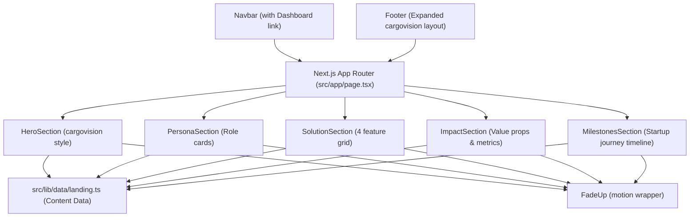

# Main Landing Page Redesign (Cargovision.app Layout) — Implementation Plan

## Goal Description

Redesign and rebuild the main landing page (`src/app/page.tsx`) to match the design structure and layout of [cargovision.app](https://cargovision.app/). The updated landing page will showcase **TANGKIS** (Pemantauan Kesiapan Bahan Bakar Genset Cadangan) with a high-conversion, modern SaaS/Deep-Tech layout featuring:

1. **Hero Section** — Impact headline, subheadline, dual CTAs ("Lihat Dashboard" & "Jelajahi Solusi"), and interactive Dashboard UI preview card.
2. **Persona / Inspiration Section** — "Terinspirasi oleh Para Profesional yang Menjaga Keandalan Energi" with interactive role cards (Facility Manager, Operator Genset, Compliance Specialist, Plant Director).
3. **Solution Deep-Dive Section** — "Cara Baru Memahami Kesiapan & Kualitas Bahan Bakar" grid (Automated Inspection, Digital Evidence & Compliance, Live Monitoring & Alerting, Clean Energy Impact).
4. **Impact / Operating Model Section** — "Mengubah Cara Fasilitas Kritis Mengelola Bahan Bakar Cadangan" with metric highlight cards.
5. **Startup Milestones Journey Section** — Timeline showcasing hackathons, Pertamuda Seed & Scale Top 3, and global startup achievements.
6. **Footer** — Expanded brand footer with quick links, contact info, and legal copyright.

---

## User Review Required

> [!IMPORTANT]
> The content structure will be kept strictly modular in `src/lib/data/landing.ts`. You can modify text, milestones, and role cards in `landing.ts` at any time without editing UI component logic.

> [!NOTE]
> All section components will leverage Framer Motion (`FadeUp.tsx`) for scroll-triggered entrance animations, maintaining parity with Next.js 14 Client Components guidelines.

---

## Open Questions

> [!NOTE]
> **Dashboard Preview Image / Link**: The Hero section will include a preview mockup box linking to `/dashboard`. Once real screenshot assets are available, they can be placed in `public/images/dashboard-preview.png`.

---

## Architecture Overview



---

## Proposed Changes

### 1. Data Layer

#### [NEW] `src/lib/data/landing.ts`
```ts
export const landingData = {
  hero: {
    badge: "Pemantauan Kesiapan Bahan Bakar Genset Berbasis IoT & AI",
    headline: "Bangun Sistem Energi Cadangan yang Lebih Efisien & Handal",
    subheadline:
      "Dukung operasional industri, rumah sakit, dan pusat data yang lebih aman dan ramah lingkungan dengan pemantauan kesiapan bahan bakar genset cadangan secara real-time.",
    primaryCta: { label: "Mulai Sekarang", href: "/dashboard" },
    secondaryCta: { label: "Jelajahi Solusi", href: "#solution" },
  },
  personas: {
    badge: "Persona & Pengguna",
    title: "Terinspirasi oleh Para Profesional yang Menjaga Keandalan Energi Setiap Hari",
    description:
      "Setiap hari, operator genset, tim maintenance, ahli kepabeanan & regulasi, dan manajer fasilitas bekerja menjaga keandalan listrik cadangan. TANGKIS dibangun untuk membantu mereka bekerja lebih cepat, aman, dan efisien.",
    roles: [
      { id: "operator", title: "Operator Genset", description: "Memantau kondisi fisik dan level bahan bakar tangki harian secara presisi." },
      { id: "facility", title: "Facility Manager", description: "Memastikan zero unplanned outage pada saat suplai listrik utama terputus." },
      { id: "compliance", title: "Compliance Specialist", description: "Memenuhi spesifikasi B50 Kepmen ESDM 257/2026 tanpa proses uji manual berlebih." },
      { id: "director", title: "Terminal / Plant Director", description: "Mengoptimalkan biaya perawatan genset dan risiko kontaminasi air pada solar." },
    ],
  },
  solutions: {
    badge: "Solusi Utama",
    title: "Cara Baru Memahami Kesiapan & Kualitas Bahan Bakar",
    description:
      "Dengan sensor IoT presisi tinggi dan pemantauan real-time, TANGKIS menetapkan standar baru untuk pemantauan bahan bakar genset cadangan.",
    items: [
      {
        id: "automated-inspection",
        title: "Automated Inspection",
        description: "Menggunakan sensor IoT dan logika analitik untuk mengenali pola peningkatan kadar air (ppm) dan suhu solar.",
        icon: "sensor",
      },
      {
        id: "digital-evidence",
        title: "Digital Evidence & Compliance",
        description: "Dokumentasi digital otomatis untuk audit standar mutu bahan bakar B50 ESDM 257/2026.",
        icon: "evidence",
      },
      {
        id: "live-monitoring",
        title: "Live Monitoring & Alerting",
        description: "Dashboard pemantauan terpusat dengan indikator status LED real-time dan sistem peringatan dini.",
        icon: "monitoring",
      },
      {
        id: "clean-energy",
        title: "Clean Energy Impact",
        description: "Mencegah pembusukan solar dan pemborosan bahan bakar untuk mendukung efisiensi operasional.",
        icon: "energy",
      },
    ],
  },
  impacts: {
    title: "Mengubah Cara Fasilitas Kritis Mengelola Bahan Bakar Cadangan",
    subheadline: "Teknologi yang membuat pemantauan bahan bakar lebih cepat, transparan, dan teruji.",
    cards: [
      {
        title: "Pemeriksaan 24/7 Otomatis",
        description: "Pemantauan kontinyu tanpa perlu pengambilan sampel manual secara berulang.",
      },
      {
        title: "Zero Unplanned Blackout",
        description: "Deteksi dini kontaminasi air mencegah kegagalan starter genset cadangan saat darurat.",
      },
      {
        title: "Kepatuhan ESDM 257/2026",
        description: "Laporan siap cetak untuk membuktikan kelayakan bahan bakar sesuai ambang 300 ppm.",
      },
    ],
  },
  milestones: {
    badge: "Rekam Jejak",
    title: "Perjalanan TANGKIS di Dunia Inovasi & Startup",
    subheadline: "Dari ide awal hingga pengakuan di kompetisi nasional & forum energi.",
    timeline: [
      { year: "2026", title: "UI Incubate Hackathon", description: "Program awal yang membantu validasi ide dan arah solusi teknologi pemantauan IoT." },
      { year: "2026", title: "Forum Energi Nasional", description: "Momen memperkenalkan konsep inspeksi digital bahan bakar genset kepada pelaku industri." },
      { year: "2026", title: "Pertamuda Seed & Scale", description: "Pencapaian Top 3 nasional dan pendanaan prototipe pemantauan kesiapan genset." },
      { year: "2026", title: "Global Startup Acceleration", description: "Pengakuan internasional untuk inovasi efisiensi dan keberlanjutan energi cadangan." },
    ],
    footerText: "Dan perjalanan baru saja dimulai. Kami terus berinovasi untuk masa depan energi cadangan yang efisien.",
  },
};
```

---

### 2. Section Components (Cargovision Layout)

#### [MODIFY] `src/components/sections/HeroSection.tsx`
- Refactor to match cargovision.app hero layout:
  - Top pill tag: `Pemantauan Kesiapan Bahan Bakar Genset Berbasis IoT & AI`
  - Headline + Subheadline
  - Dual action buttons (Primary: `/dashboard`, Secondary: `#solution`)
  - Interactive Dashboard Card Preview with live LED indicator and link to `/dashboard`

#### [NEW] `src/components/sections/PersonaSection.tsx`
- Render inspiration block & 4 role cards (Operator, Facility Manager, Compliance, Director)
- Interactive tab/card hover states showing pain points & solutions provided by TANGKIS

#### [NEW] `src/components/sections/SolutionSection.tsx`
- Render 4-column / 2x2 grid corresponding to cargovision's "Cara Baru Memahami Setiap Kontainer" layout
- Feature icons, title, description, and link to `/dashboard`

#### [NEW] `src/components/sections/ImpactSection.tsx`
- Render 3 high-impact highlight banners matching "Mengubah cara pelabuhan beroperasi" layout

#### [NEW] `src/components/sections/MilestonesSection.tsx`
- Render horizontal/vertical timeline matching cargovision's "Perjalanan Kami di Dunia Startup"
- Highlight UI Incubate Hackathon, Forum Energi, Pertamuda Seed & Scale (Top 3), and Global Startup

---

### 3. Layout & Main Page Assembly

#### [MODIFY] `src/components/layout/Footer.tsx`
- Update footer to mirror cargovision.app footer structure (Brand slogan, Navigation links, Mailto contact, Copyright line).

#### [MODIFY] `src/app/page.tsx`
```tsx
import HeroSection from "@/components/sections/HeroSection";
import PersonaSection from "@/components/sections/PersonaSection";
import SolutionSection from "@/components/sections/SolutionSection";
import ImpactSection from "@/components/sections/ImpactSection";
import MilestonesSection from "@/components/sections/MilestonesSection";

export default function HomePage() {
  return (
    <main className="bg-slate-900 text-slate-100 min-h-screen">
      <HeroSection />
      <PersonaSection />
      <SolutionSection />
      <ImpactSection />
      <MilestonesSection />
    </main>
  );
}
```

---

## Verification Plan

### Automated Tests
```bash
# TypeScript type check
npx tsc --noEmit

# ESLint
npx next lint
```

### Manual Verification
| Check | Expected Result |
|---|---|
| `npm run dev` → `http://localhost:3000` | Landing page loads with Cargovision layout styling |
| Hero Section | Displays badge, headline, CTAs, and interactive dashboard preview link |
| Persona Section | Displays 4 role cards with hover states |
| Solution Grid | 4 solution feature items (Automated Inspection, Digital Evidence, Live Monitoring, Clean Energy Impact) render with icons |
| Impact Section | 3 value proposition cards display cleanly |
| Milestones Section | Timeline renders 4 achievements including Pertamuda Seed & Scale Top 3 |
| Responsive check (375px & 1440px) | Layout gracefully switches from mobile single column to desktop grid |
| `npm run build` | Next.js static export / production build compiles without errors |
